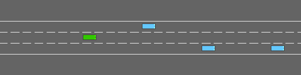
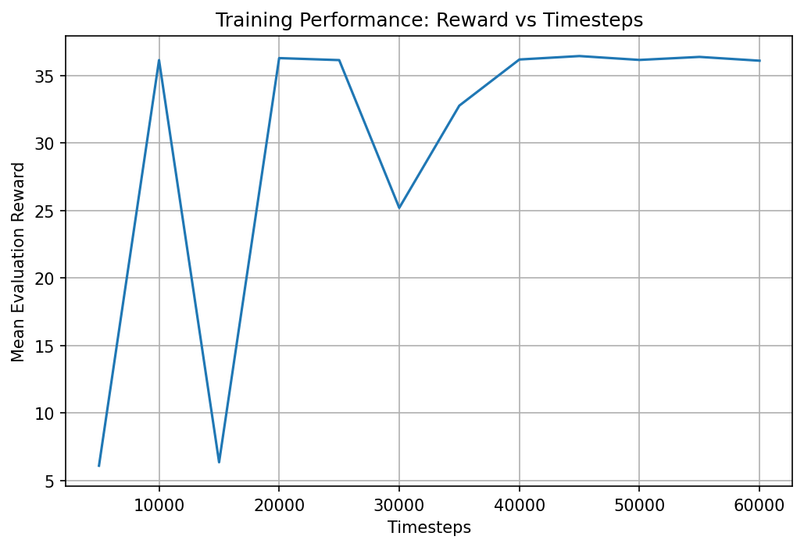

# Applied Reinforcement Learning – DQN on Highway-Env

## 👥 Group Members
- **Orhan Yilmaz**
  - Designed and implemented the reinforcement learning pipeline using Deep Q-Networks (DQN)
  - Configured and customized the Highway-Env environment and reward function
  - Implemented training scripts for untrained, half-trained, and fully-trained agents
  - Generated evaluation results, including reward curves and training visualizations
  - Recorded and processed GIFs demonstrating the agent’s learning progression
- **Hocine Douar**
  - Assisted with theoretical analysis of reinforcement learning concepts and DQN methodology
  - Contributed to hyperparameter selection and training analysis
  - Reviewed experimental results and provided feedback on model performance
  - Collaborated on documentation and report structure

---

## 📌 Overview
This project explores the application of **Deep Reinforcement Learning** to an autonomous driving scenario using the **Highway-Env** environment. The goal is to train an agent that can drive efficiently in dense traffic while avoiding collisions.  
The task involves **multi-objective optimization**, balancing speed, lane discipline, and safety.

---

## 🧠 Algorithm
We employ a **Deep Q-Network (DQN)** to approximate the optimal action-value function:

\[
Q^*(s,a) = \mathbb{E}\left[r_t + \gamma \max_{a'} Q(s_{t+1}, a') \mid s_t=s, a_t=a\right]
\]

DQN combines classical Q-learning with deep neural networks, enabling learning from high-dimensional state observations.  
To stabilize training, **experience replay** and a **target network** are used. During training, the agent follows an **ε-greedy policy**, gradually shifting from exploration to exploitation.

---

## 🎮 Environment
The environment used is **`highway-fast-v0`** from the `highway-env` library.  
The agent controls a vehicle navigating a multi-lane highway populated with other vehicles. The environment is stochastic and requires continuous decision-making.

**Environment configuration:**
- Number of lanes: 3  
- Number of vehicles: 30  
- Episode duration: 40 seconds  

---

## 📊 Training Stages

<p align="center">
  
</p>

### Untrained Agent
The untrained agent behaves randomly, frequently colliding with other vehicles and failing to maintain stable driving behavior.

### Half-Trained Agent (20K steps)
After partial training, the agent begins to demonstrate meaningful behavior. It avoids some collisions and survives longer episodes, though mistakes are still common.

### Fully-Trained Agent (60K steps)
The fully trained agent successfully balances speed and safety, performs smooth lane changes, and avoids collisions for extended periods.

---

## 📈 Training Curve

<p align="center">
  
</p>

Initially, the agent exhibits very unstable performance due to insufficient experience stored in the replay buffer. During the early training phase (below 10,000 timesteps), the average evaluation reward remains low (around 5–7), indicating largely random behavior and frequent collisions.

Between 10,000 and 15,000 timesteps, the reward shows a sharp fluctuation, including a temporary drop, which reflects the agent’s ongoing exploration and unstable policy updates while the replay buffer is still being populated.

After approximately 15,000 timesteps, a clear improvement trend emerges. The average evaluation reward increases rapidly and stabilizes around 35–37, demonstrating that the agent has successfully learned effective driving strategies. In this phase, the DQN begins to balance speed and safety more consistently, resulting in fewer collisions and longer survival times.

Beyond 40,000 timesteps, the reward curve shows minor oscillations around a high value, which is typical for ε-greedy policies. This behavior indicates convergence of the DQN model, where learning continues but with diminishing performance gains.

Overall, the training curve confirms that the agent transitions from random exploration to a stable and efficient policy, validating the effectiveness of the chosen reward function, hyperparameters, and training setup.

---

## 🧮 Reward Function
The reward function used in the Highway environment is defined as:

\[
R(s, a) =
\begin{cases}
-5, & \text{if a collision occurs} \\
0.5 \cdot v_{\text{norm}} + 0.1 \cdot \mathbb{I}(\text{right lane}), & \text{otherwise}
\end{cases}
\]

where:
- \( v_{\text{norm}} \) is the normalized vehicle speed  
- \( \mathbb{I}(\cdot) \) is an indicator function equal to 1 if the agent is driving in the rightmost lane  

This reward structure strongly penalizes collisions while encouraging fast and lane-disciplined driving.

---

## ⚙️ Hyperparameters
The main hyperparameters used during training are:

- Learning rate: **1e-4**
- Discount factor (γ): **0.99**
- Replay buffer size: **100,000**
- Batch size: **64**
- Training frequency: **every 4 steps**
- Target network update interval: **1,000 steps**

---

## ⚠️ Challenges & Failures
A major challenge during training was **unstable lane-switching behavior**, where the agent oscillated between lanes.  
This issue was mitigated by adjusting the reward structure and lowering the learning rate, resulting in smoother driving behavior and more stable convergence.

---

## 🗂 Project Structure

```text
.
├── src/
│   ├── envs.py
│   ├── train_half_dqn.py
│   ├── train_full_dqn.py
│   ├── record_gif.py
│   └── plot_rewards.py
├── models/
├── logs/
├── media/
│   ├── evolution.gif
│   └── reward_curve.png
├── requirements.txt
└── README.md

---


## ▶️ How to Run
```bash
To reproduce the results of this project, clone the repository, install the required dependencies, train the agent, and generate the evaluation outputs using the following commands:
git clone https://github.com/USERNAME/REPOSITORY_NAME.git
cd REPOSITORY_NAME
python -m venv venv
venv\Scripts\activate
pip install -r requirements.txt
python src/train_full_dqn.py
python src/plot_rewards.py
python src/record_gif.py


All generated models, plots, and videos are automatically saved in the models/, logs/, and media/ directories.
